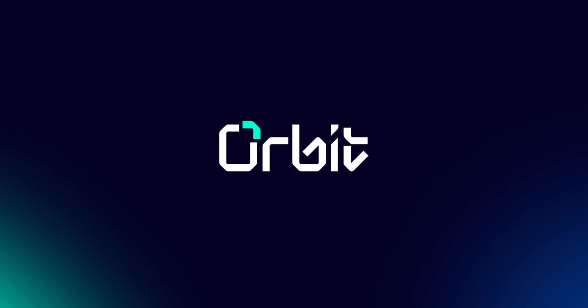
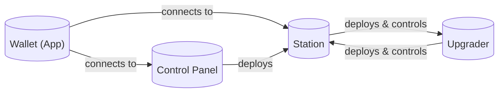
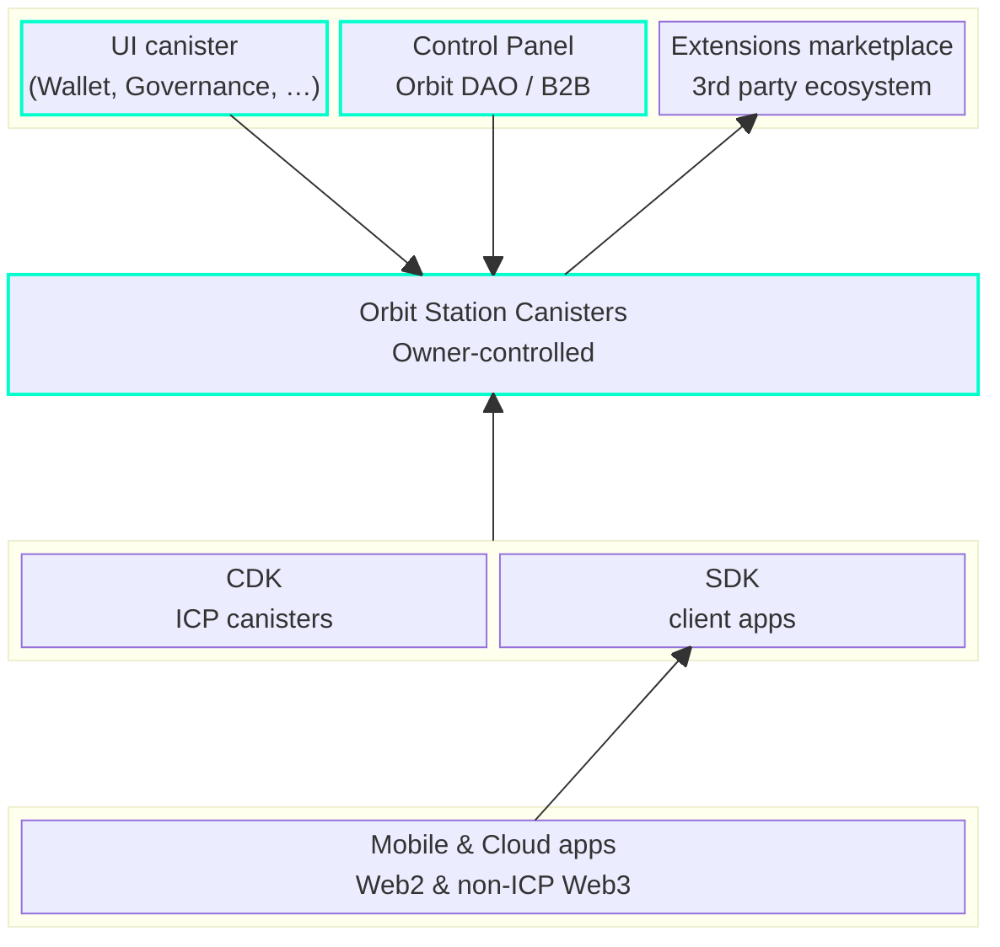

> This project is **still in Alpha**. We are happy to answer questions if they are raised as issues in this github repo.

[](https://internetcomputer.org)
[](LICENSE)
[](./actions/workflows/tests.yaml)

<div style="display:flex;flex-direction:column;">
  <br />
</div>

Check out the [Orbit Wallet](https://orbitwallet.io) to see the platform in action.

## Overview

Orbit is an innovative platform layer built for the Internet Computer Protocol (ICP) and designed to extend to other blockchains. Inspired by the evolutionary leap from IaaS to PaaS in cloud computing, Orbit aims to simplify the development of blockchain applications, enabling developers from both Web2 and Web3 backgrounds to build future-proof applications where they can focus on their business logic and not the underlying blockchain integrations.

## Vision 

Our vision with Orbit is to emulate the transformation that Cloud providers brought to computing, by providing a platform that significantly lowers the entry barrier for blockchain application development. The institutional wallet started as our "demo app", demonstrating the potential of ICP’s Chain Fusion. However, the core of our innovation lies in the platform itself, which enables developers to build diverse applications, from simple single-user wallets to complex multi-approval Enterprise Systems, all with the same ease of use.

## User facing applications

The [orbitwallet.io](https://orbitwallet.io) is the main entry point for users to interact with the Orbit platform. It provides access to the Orbit Wallet application, which is a dapp that allows users to manage their digital assets tailored for multi-approval scenarios. The wallet supports user management, transaction history, permissions management, and other features that are essential for managing digital assets in a secure and user-friendly way.

## System Overview



Orbit is composed of several components, each with its own role and responsibilities. Here is a brief overview of each component:

- **Wallet (App)**: The initial showcase application we've built on top of Orbit Core Services. It is responsible for managing users, transactions, and other wallet-related operations.
- **Control Panel**: The control panel is a canister that facilitates common operations for accessing and managing Orbit Stations.
- **Station**: A station is the core canister component of Orbit. It is a trustless multi-custody canister that allows users to manage their digital assets and operations.
- **Upgrader**: The upgrader is responsible for managing the lifecycle of the station canister. It allows for seamless and secure upgrades of the station canister.

For detailed information on orbit components and terminology, please refer to the [Orbit Glossary](./docs/GLOSSARY.md).

## Target Architecture

The Orbit platform is designed to be modular and extensible, allowing developers to build a wide range of applications on top of it. The platform consists of several components, including the Orbit Station canisters, UI canisters and Control Panel. Developers can build custom applications using the Orbit SDK and CDK, and extend the platform with third-party integrations from the Extensions Marketplace for additional functionality. The highlighted components are part of the current release. The remaining components will be developed in future iterations.




## Build and run yourself

### Requirements

Please make sure you have the following installed:

- [Rust](https://www.rust-lang.org/learn/get-started)
- [DFX](https://internetcomputer.org/docs/current/developer-docs/setup/install)
- [nvm](https://github.com/nvm-sh/nvm)

### Building the Code

Start a local replica listening on port 4943:

```
dfx start --clean --host 127.0.0.1:4943
```

Then the following steps can be used to setup the Orbit canister ecosystem for local development.

```bash
./orbit --init
```

This will build the canisters, install the required node modules and deploy the canisters to your local replica. All the canisters will be deployed to the `local` network with their fixed canister ids.

You can access the wallet interface at [http://werw6-ayaaa-aaaaa-774aa-cai.localhost:4943](http://werw6-ayaaa-aaaaa-774aa-cai.localhost:4943).

### Local development

See [HACKING](HACKING.md)

## Licensing

This project is licensed under the [Apache 2.0](./LICENSE) license.

## Contributing

This project is currenly in alpha and is not yet open for contributions. We are working on a roadmap to open them up in the future.

## Show your support

If you find this project as exciting as we do, let us know by starring this repository ⭐️

Your support encourages us to keep innovating and striving to deliver the best possible blockchain platform for developers.
