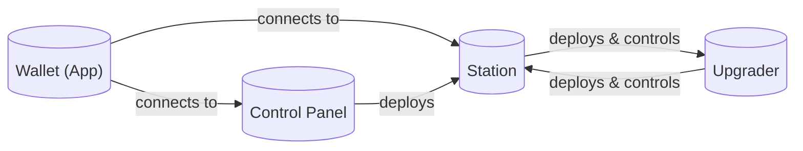
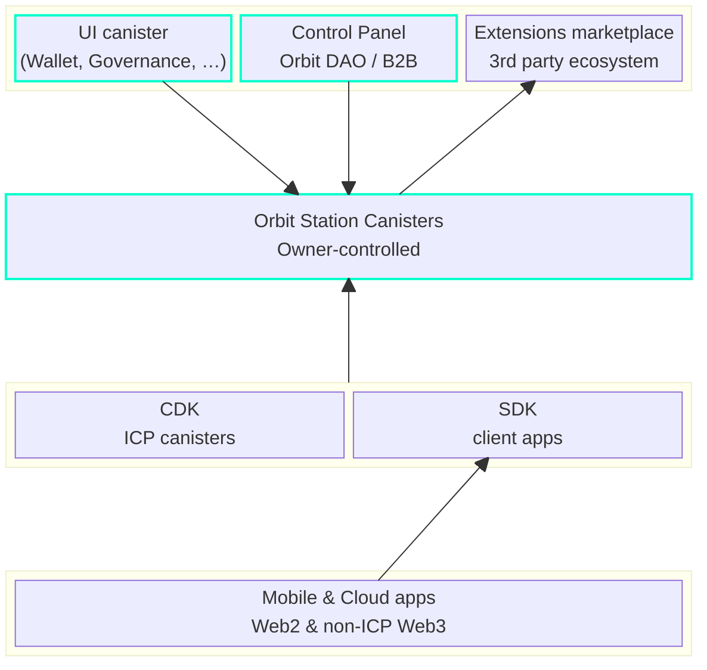

> This project is **still in Alpha**. We are happy to answer questions if they are raised as issues in this GitHub repo.

[](https://internetcomputer.org)
[](LICENSE)
[](https://github.com/dfinity/orbit/actions/workflows/tests.yaml)

<div style="display:flex;flex-direction:column;">
  <br />
</div>

Try [Orbit Wallet](https://app.orbit.global) to see the platform running.

## Overview

Orbit runs multi-approval asset management on the Internet Computer Protocol (ICP). Each organization gets a Station, a canister that holds its assets and moves them only after the required number of approvals. Applications call the Station instead of signing chain transactions themselves, so a team can add treasury operations without writing ledger integrations.

Support for chains beyond ICP is planned and not built yet.

## Vision

The institutional wallet started as a demo app for ICP's Chain Fusion, but the platform under it is the product. The same Station and the same approval rules cover a single-user wallet and an enterprise setup that needs several sign-offs, so a developer chooses an approval policy rather than building one.

We want building on Orbit to take about as much work as building on a cloud platform, with the chain integrations already handled.

## User facing applications

[orbit.global](https://orbit.global) is the landing page. Orbit Wallet itself runs at [app.orbit.global](https://app.orbit.global), where a user signs in to manage an organization's assets: adding and removing users, setting permissions and approval policies, submitting and approving transfers, and reading the transaction history.

## System Overview


```mermaid
flowchart LR
    wallet[("Wallet (App)")] -- connects to --> Control_Panel;
    wallet -- connects to --> Station;

    Control_Panel[(Control Panel)] -- deploys --> Station;
    Station[(Station)] -- deploys & controls --> Upgrader;
    Upgrader[(Upgrader)] -- deploys & controls --> Station;
```

The components:

- **Wallet (App)**: The frontend users log into. It reads and writes through a Station, and it was the first application built on Orbit.
- **Control Panel**: One global canister. It deploys a new Station when someone asks for one, stores the Station and Upgrader wasms that stations upgrade to, and lists the stations a user belongs to.
- **Station**: One canister per organization, holding the assets, the users and their permissions, and the approval policies. It carries out an operation only once that operation's policy is satisfied, so no single Orbit operator can move funds.
- **Upgrader**: One per Station, paired with it. The Station and its Upgrader control each other, so the Upgrader installs a new Station wasm and can restore the Station if an upgrade goes wrong.

The [Orbit Glossary](docs/old/GLOSSARY.md) defines these components and the rest of the terminology.

## Target Architecture

The diagram below shows where Orbit is heading. The highlighted boxes ship today: the Station canisters, the UI canisters, and the Control Panel. The rest is planned and not built yet: a CDK for writing canisters against a Station, an SDK for client apps, and an extensions marketplace for third-party integrations.


```mermaid
block-beta
  columns 1
    block:COMPONENTS
      apps["UI canister<br />(Wallet, Governance, …)"]
      control_panel["Control Panel<br />Orbit DAO / B2B"]
      marketplace["Extensions marketplace<br />3rd party ecosystem"]
    end
    space
    station["Orbit Station Canisters<br/>Owner-controlled"]
    space
    block:DEV
      cdk["CDK<br />ICP canisters"]
      sdk["SDK<br />client apps"]
    end
    space
    block:ECOSYSTEM
      integrations["Mobile & Cloud apps<br />Web2 & non-ICP Web3"]
    end
    apps --> station
    control_panel --> station
    DEV --> station
    integrations --> sdk
    station --> marketplace
    style station stroke:#00ffcc,stroke-width:2px
    style apps stroke:#00ffcc,stroke-width:2px
    style control_panel stroke:#00ffcc,stroke-width:2px
```


## Build and run yourself

### Requirements

Install these first:

- [Rust](https://www.rust-lang.org/learn/get-started)
- [DFX](https://internetcomputer.org/docs/current/developer-docs/setup/install)
- [nvm](https://github.com/nvm-sh/nvm)

### Building the Code

Start PocketIC with system canisters (ICP ledger, ICP index, CMC, Internet Identity) listening on port 4943:

```
dfx start --clean --system-canisters --host 127.0.0.1:4943
```

Note that PocketIC should be stopped using `dfx stop` rather than by CTRL^C.

Then set up the Orbit canisters for local development:

```bash
./orbit --init
```

The script builds the canisters, installs the node modules, and deploys everything to the `local` network with fixed canister ids.

The wallet interface is then at [http://werw6-ayaaa-aaaaa-774aa-cai.localhost:4943](http://werw6-ayaaa-aaaaa-774aa-cai.localhost:4943).

### Local development

See [HACKING](HACKING.md)

## Licensing

This project is licensed under the [Apache 2.0](./LICENSE) license.

## Contributing

This project is in alpha and not yet open for contributions. We are working on a roadmap to open them up.

## Show your support

If you find this project as exciting as we do, let us know by starring this repository ⭐️
