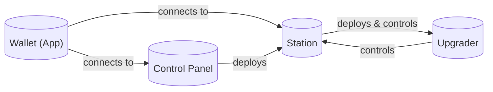

# Orbit glossary

This glossary is intended to provide a reference for users and developers to navigate within the Orbit ecosystem. It includes technical terms, Orbit-specific terms, and wallet terms.

# Table of Contents

- [Introduction](#introduction)
- [Internet Computer Terms](#technical-terms)
- [Orbit Components](#orbit-components)
- [Orbit Terms](#orbit-terms)
- [Orbit Wallet Terms](#orbit-wallet-terms)
- [Conclusion](#conclusion)

# Introduction

Orbit is composed of a set of canisters and tools that work together to provide a trustless multi-custody operations for managing digital assets. It is built on the Internet Computer and uses canister smart contracts to provide a secure and decentralized solution. It contains general purpose canisters, such as the Control Panel and Station, as well as, tailor made user interface for specific use cases, such as the Wallet UI for managing assets in a trustless multi-custody crypto wallet.

## Internet Computer Terms

### Canister

A canister is a type of smart contract that bundles code and state. A canister can be deployed as a smart contract on the Internet Computer and accessed over the Internet. See [Canister](https://internetcomputer.org/how-it-works/canister-lifecycle/#canisters) for more information.

### Internet Identity

Internet Identity is a decentralized identity system that allows users to authenticate themselves to the Internet Computer. It is a key component of the Orbit Wallet, as it allows users to sign in and access their wallets. See [Internet Identity](https://internetcomputer.org/docs/current/references/ii-spec) for more information.

### Principal

Principals are generic identifiers for canisters, users and possibly other concepts in the future. As far as most uses of the Internet Computer are concerned they are opaque binary blobs with a length between 0 and 29 bytes, and there is intentionally no mechanism to tell canister ids and user ids apart. See [Principal ID](https://internetcomputer.org/docs/current/references/ic-interface-spec/#principal) for more information.

Example textual representation of Principals: `un4fu-tqaaa-aaaab-qadjq-cai`

## Orbit Components

### Component overview

### Core

#### Station

A station is the core canister component of Orbit. It is a trustless multi-custody canister that allows users to manage their crypto assets and operations. Stations are created by the user and can be shared with other users to create a multi-approval system for managing assets. The station canister is the owner of the assets and is responsible for executing the operations requested by the users based on the station policies.

#### Upgrader

The upgrader is a canister that is responsible for upgrading the Orbit station canister. Each station canister has an associated upgrader canister that allows the station users to upgrade the station canister to a new version.

#### Control panel

The control panel is a canister that facilitates common operations for accessing and managing Orbit Stations. It is responsible for storing the list of station canisters the user is associated and facilitating the creation of new station canisters.

### Applications

#### Wallet

This application is tailored for token management in the Orbit ecosystem. It is a web application that allows users to interact with their stations, view their balances, send and receive tokens, and manage their accounts.

## Orbit Terms

### Request

All operations in the Station canister are performed through requests. Requests are signed by the user's Identity and are sent to the Station canister to execute them, such as sending tokens or adding a new account. Requests are only executed if they pass the relevant checks and validations, this includes the required signatures and permissions applied by the approval policies of the station.

### Request Operation

A request operation specifies what the station canister should do when executing the request. They include operations such as transferring tokens, adding accounts, or updating permissions.

#### Request Status

Requests can have the following statuses:

- **Created:** A request is in the created state when it has been submitted to the station canister for evaluation. These requests can be canceled by the user who submitted them.

- **Cancelled:** A request is in the cancelled state when it has been canceled by the user who submitted it. Cancelled requests cannot be executed by the station canister.

- **Approved:** A request is in the approved state when it has passed all rules in the Request Policy. Approved requests can be scheduled for execution by the station canister.

- **Rejected:** A request is in the rejected state when it has failed to pass the rules in the Request Policy. Rejected requests cannot be executed by the station canister.

- **Scheduled:** A request is in the scheduled state when it has been approved and is waiting to be executed. Scheduled requests are executed by the station canister in the scheduled order.

- **Processing:** A request is in the processing state when it is being executed by the station canister. These requests are being processed and will transition to the completed or failed state once the execution is complete.

- **Completed:** A request is in the completed state when it has been successfully executed by the station canister. Completed requests have successfully performed the operation specified.

- **Failed:** A request is in the failed state when it has failed to be executed by the station canister. Failed requests have not performed the operation specified.

#### Request Policy

A Request Policy is a set of rules that define the behavior of requests in the station canister. Policies are used to enforce security measures, such as requiring multiple signatures to execute a request, they are defined by authorized users and can be customized to fit the needs of different use cases.

#### Request Policy Rule

A Request Policy Rule is a condition that must be met for a request to be approved by the station canister. Rules can be based on the request operation, the request proposer, or other parameter of the request. Policy rules are defined by authorized users and can be customized to fit the needs of different use cases.

These rules can be of the following types:

- **Auto-Approve:** An auto-approve rule automatically approves requests, regardless of the parameters. Auto-approve rules can be used to expedite the execution of requests that do not require manual approval, this is commonly used on single user stations.

- **Quorum:** A quotum rule requires a minimum number of signatures to approve a request. Quorum rules can be used to enforce multi-signature requirements for executing requests.

- **Quorum-Percentage:** A percentage rule requires a minimum percentage of users to approve a request. Percentage rules can be used to enforce multi-signature requirements based on the percentage of users in the station.

- **Allow listed:** Allow-listed rules can be used to restrict transfers to specific addresses that are in the address book.

- **Allow listed by metadata:** Allow-listed by metadata rules can be used to restrict transfers to specific addresses that are in the address book and have a specific metadata field.

There are also the following composite rules that can be used to combine multiple rules:

- **All of:** A rule that requires all of the sub-rules to be approved. This rule can be used to enforce complex approval requirements that involve multiple conditions.

- **Any of:** A rule that requires any of the sub-rules to be approved. This rule can be used to enforce flexible approval requirements that allow for multiple conditions.

- **Not:** A rule that requires the sub-rule to be rejected. This rule can be used to enforce negative approval requirements that prevent specific conditions from being met. An example of this rule is to prevent a specific user from approving a request.

#### Request Policy Approval

Request Policy Approval is the process of approving a request. Users can add their approval decision to a request based on the rules defined in the Request Policy.

### Permission

Permissions are rules that define the functionality that a user can access in a station canister. Permissions are defined by the authorized station users and can be customized to fit the needs of different use cases. Permissions can be granted to individual users, groups of users or any (un)authenticated user and can be revoked at any time.

### Asset

An Orbit Asset holds metadata about an asset on the blockchain. Besides typical properties like Name and Symbol, it also stores which blockchain the asset is on, what token standards it supports, the contract address(es), etc. Assets can be added/changed/removed through requests. The native ICP asset is added by default to new Orbit stations.

### Account

An account is a record in the station canister that represents a user's ownership of specific assets. Accounts can hold multiple types of assets, such as tokens, NFTs, or other fungible or non-fungible assets. Accounts can be created, updated, and archived by the station users through requests.

#### Account Name

An account name is a human-readable name that represents the account in the station canister. Account names can be customized by privileged users and are unique within the station canister.

#### Account Asset

An account can hold multiple types of assets, on any supported blockchains, and any supported standards. Assets can be added and removed from accounts. Removing an asset does not result in losing funds, readding the asset restores access.

#### Account Address

An account address is a unique identifier that represents the account address in relation to the asset it holds. An account can have many addresses derived from the account seed, as assets support different token standards and address formats.

#### Account Balance

An account asset's balance is the amount of a specific asset that an account holds. Account balances are updated when assets are deposited or withdrawn from the account.

### Address Book

The address book is a feature of the station canister that allows users to store and manage a list of addresses. The address book can be used to store the addresses of other users, contracts, or services that the user interacts with frequently.

#### Address Book Entry

An address book entry is a record in the address book that represents an address and its associated metadata. Address book entries can be created, updated, and deleted by the user.

#### Address Book Entry Name

An address book entry name is a human-readable name that represents the address book entry in the address book. Address book entry names can be customized by the user and are unique within the address book for the same address type.

### Station Name

The station name is a human-readable name that represents the station canister. The station name can be customized by the user and is unique within the user's account of the control panel canister.

### Station Version

The station version is a number that represents the version of the station canister. The version is used to tailor the Wallet UI to the specific features and capabilities of the station canister.

### Station ID

The station ID is a unique identifier that represents the station canister in the Internet Computer. The station ID is used to uniquely identify the station canister. It uses the [Principal](#principal) format.

### Identity

The identity is a unique identifier that represents the user in the Internet Computer. The identity is used to uniquely identify the user and is associated with the user's Control Panel canister. The identity is also used to associate the user with the station canister. It uses the [Principal](#principal) format.

## Orbit Wallet Terms

### Wallet ID

The Wallet ID is a unique identifier that represents the user's wallet in the Internet Computer. The Wallet ID is used to uniquely identify the user's wallet and is associated with the user's Internet Identity. The Wallet ID is the same as the [Station ID](#station-id) used more broadly in the Orbit ecosystem.

### Wallet Name

The wallet name is a human-readable name that represents the user's wallet in the Internet Computer. The wallet name can be customized by the user and is unique within the user's account of the control panel canister. The wallet name is the same as the [Station Name](#station-name) used more broadly in the Orbit ecosystem.

# Conclusion

This glossary is a living document that will be updated as new terms and concepts are introduced in the Orbit ecosystem. If you have any questions or suggestions for terms to be added to the glossary, please feel free to reach out to the Orbit team.
